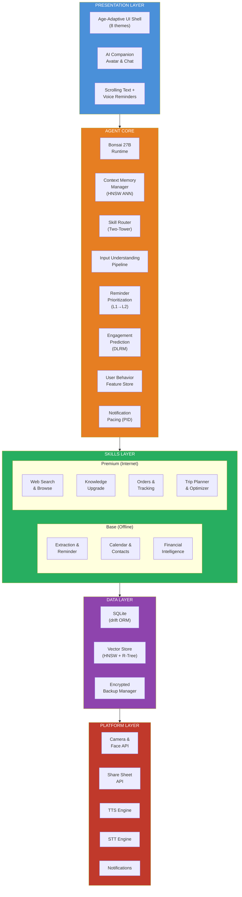

# Plnner and Reminder — High-Level Architecture

```mermaid
graph TB
    subgraph PRESENTATION["PRESENTATION LAYER"]
        direction LR
        UI["Age-Adaptive UI Shell<br/>(8 themes)"]
        COMP["AI Companion<br/>Avatar & Chat"]
        REM["Scrolling Text +<br/>Voice Reminders"]
    end

    subgraph AGENT["AGENT CORE"]
        direction LR
        BONSAI["Bonsai 27B<br/>Runtime"]
        MEMORY["Context Memory<br/>Manager<br/>(HNSW ANN)"]
        ROUTER["Skill Router<br/>(Two-Tower)"]
        IUP["Input Understanding<br/>Pipeline"]
        RANK["Reminder<br/>Prioritization<br/>(L1→L2)"]
        ENGAGE["Engagement<br/>Prediction<br/>(DLRM)"]
        FEATURES["User Behavior<br/>Feature Store"]
        PACER["Notification<br/>Pacing (PID)"]
    end

    subgraph SKILLS["SKILLS LAYER"]
        direction LR
        subgraph BASE["Base (Offline)"]
            S1["Extraction &<br/>Reminder"]
            S2["Calendar &<br/>Contacts"]
            S3["Financial<br/>Intelligence"]
        end
        subgraph PREMIUM["Premium (Internet)"]
            S4["Web Search<br/>& Browse"]
            S5["Knowledge<br/>Upgrade"]
            S6["Orders &<br/>Tracking"]
            S7["Trip Planner<br/>& Optimizer"]
        end
    end

    subgraph DATA["DATA LAYER"]
        direction LR
        DB["SQLite<br/>(drift ORM)"]
        VEC["Vector Store<br/>(HNSW + R-Tree)"]
        BACKUP["Encrypted<br/>Backup Manager"]
    end

    subgraph PLATFORM["PLATFORM LAYER"]
        direction LR
        CAM["Camera &<br/>Face API"]
        SHARE["Share Sheet<br/>API"]
        TTS["TTS Engine"]
        STT["STT Engine"]
        NOTIF["Notifications"]
    end

    PRESENTATION --> AGENT
    AGENT --> SKILLS
    SKILLS --> DATA
    DATA --> PLATFORM

    style PRESENTATION fill:#4A90D9,color:#fff
    style AGENT fill:#E67E22,color:#fff
    style SKILLS fill:#27AE60,color:#fff
    style DATA fill:#8E44AD,color:#fff
    style PLATFORM fill:#C0392B,color:#fff
```
