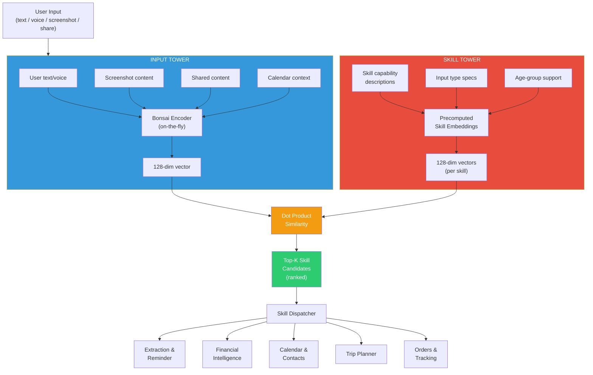
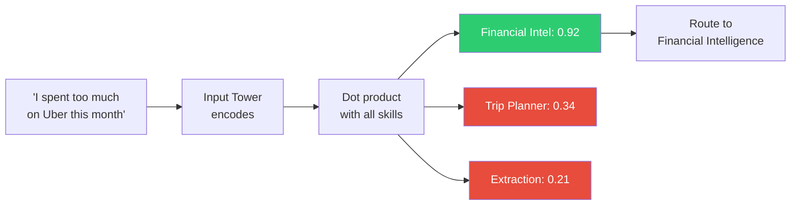

# Two-Tower Skill Router (Intent Matching)

Adapted from Meta's Two-Tower ANN candidate retrieval and Airbnb's query-listing matching.

```mermaid
graph TB
    INPUT["User Input<br/>(text / voice / screenshot / share)"]

    subgraph INPUT_TOWER["INPUT TOWER"]
        IT1["User text/voice"]
        IT2["Screenshot content"]
        IT3["Shared content"]
        IT4["Calendar context"]
        IT_ENC["Bonsai Encoder<br/>(on-the-fly)"]
        IT_VEC["128-dim vector"]

        IT1 --> IT_ENC
        IT2 --> IT_ENC
        IT3 --> IT_ENC
        IT4 --> IT_ENC
        IT_ENC --> IT_VEC
    end

    subgraph SKILL_TOWER["SKILL TOWER"]
        ST1["Skill capability<br/>descriptions"]
        ST2["Input type specs"]
        ST3["Age-group support"]
        ST_ENC["Precomputed<br/>Skill Embeddings"]
        ST_VEC["128-dim vectors<br/>(per skill)"]

        ST1 --> ST_ENC
        ST2 --> ST_ENC
        ST3 --> ST_ENC
        ST_ENC --> ST_VEC
    end

    INPUT --> INPUT_TOWER
    IT_VEC --> DOT["Dot Product<br/>Similarity"]
    ST_VEC --> DOT

    DOT --> TOPK["Top-K Skill<br/>Candidates<br/>(ranked)"]

    TOPK --> DISPATCH["Skill Dispatcher"]

    DISPATCH --> SK1["Extraction &<br/>Reminder"]
    DISPATCH --> SK2["Financial<br/>Intelligence"]
    DISPATCH --> SK3["Calendar &<br/>Contacts"]
    DISPATCH --> SK4["Trip Planner"]
    DISPATCH --> SK5["Orders &<br/>Tracking"]

    style INPUT_TOWER fill:#3498DB,color:#fff
    style SKILL_TOWER fill:#E74C3C,color:#fff
    style DOT fill:#F39C12,color:#fff
    style TOPK fill:#2ECC71,color:#fff
```

## Example Routing

```mermaid
graph LR
    A["'I spent too much<br/>on Uber this month'"] --> B["Input Tower<br/>encodes"]
    B --> C["Dot product<br/>with all skills"]
    C --> D["Financial Intel: 0.92"]
    C --> E["Trip Planner: 0.34"]
    C --> F["Extraction: 0.21"]
    D --> G["Route to<br/>Financial Intelligence"]

    style D fill:#2ECC71,color:#fff
    style E fill:#E74C3C,color:#fff
    style F fill:#E74C3C,color:#fff
```
