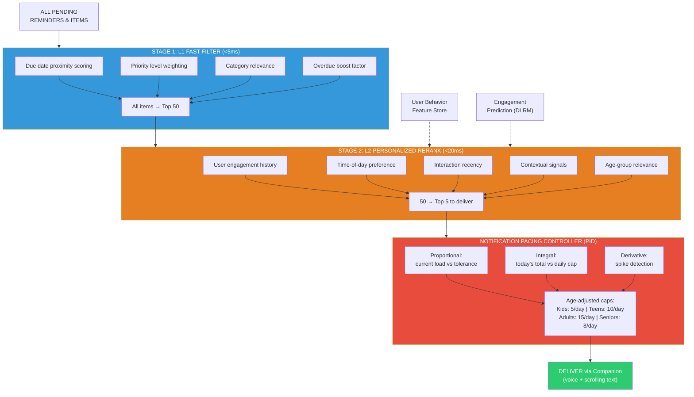

# Reminder Prioritization Pipeline (Multi-Stage Ranking + PID Pacing)

Adapted from Airbnb Two-Stage Ranking and Meta Budget Pacing.

```mermaid
graph TB
    ALL["ALL PENDING<br/>REMINDERS & ITEMS"]

    subgraph L1["STAGE 1: L1 FAST FILTER (<5ms)"]
        L1_1["Due date proximity scoring"]
        L1_2["Priority level weighting"]
        L1_3["Category relevance"]
        L1_4["Overdue boost factor"]
        L1_OUT["All items → Top 50"]
    end

    subgraph L2["STAGE 2: L2 PERSONALIZED RERANK (<20ms)"]
        L2_1["User engagement history"]
        L2_2["Time-of-day preference"]
        L2_3["Interaction recency"]
        L2_4["Contextual signals"]
        L2_5["Age-group relevance"]
        L2_OUT["50 → Top 5 to deliver"]
    end

    subgraph PID["NOTIFICATION PACING CONTROLLER (PID)"]
        PID_P["Proportional:<br/>current load vs tolerance"]
        PID_I["Integral:<br/>today's total vs daily cap"]
        PID_D["Derivative:<br/>spike detection"]
        PID_CAPS["Age-adjusted caps:<br/>Kids: 5/day | Teens: 10/day<br/>Adults: 15/day | Seniors: 8/day"]
    end

    DELIVER["DELIVER via Companion<br/>(voice + scrolling text)"]

    ALL --> L1
    L1_1 --> L1_OUT
    L1_2 --> L1_OUT
    L1_3 --> L1_OUT
    L1_4 --> L1_OUT

    L1_OUT --> L2
    L2_1 --> L2_OUT
    L2_2 --> L2_OUT
    L2_3 --> L2_OUT
    L2_4 --> L2_OUT
    L2_5 --> L2_OUT

    L2_OUT --> PID
    PID_P --> PID_CAPS
    PID_I --> PID_CAPS
    PID_D --> PID_CAPS

    PID_CAPS --> DELIVER

    FEATURES["User Behavior<br/>Feature Store"] -.-> L2
    ENGAGE["Engagement<br/>Prediction (DLRM)"] -.-> L2

    style L1 fill:#3498DB,color:#fff
    style L2 fill:#E67E22,color:#fff
    style PID fill:#E74C3C,color:#fff
    style DELIVER fill:#2ECC71,color:#fff
```
