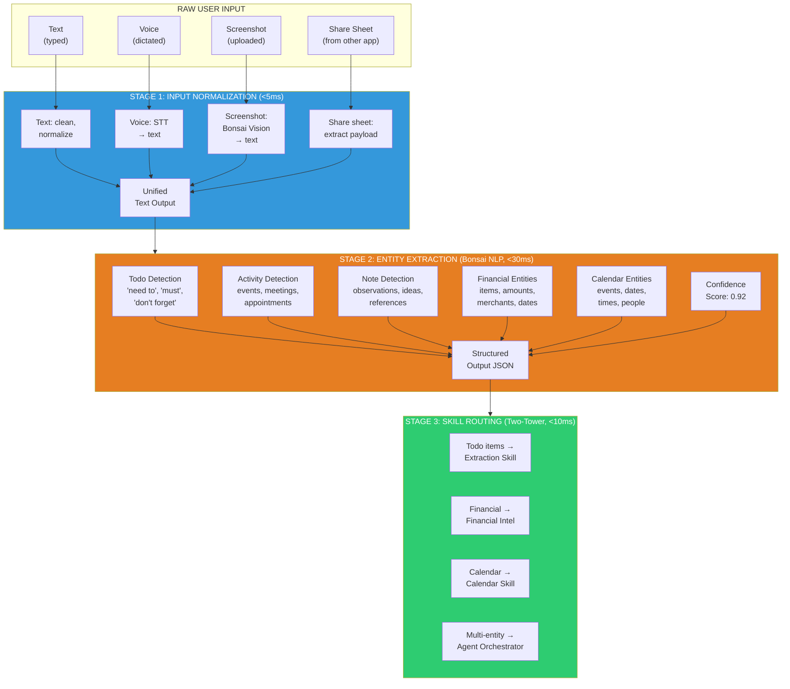

# Input Understanding Pipeline

Adapted from Airbnb's Query Understanding Service.

```mermaid
graph TB
    subgraph INPUTS["RAW USER INPUT"]
        direction LR
        TEXT["Text<br/>(typed)"]
        VOICE["Voice<br/>(dictated)"]
        SCREEN["Screenshot<br/>(uploaded)"]
        SHAREI["Share Sheet<br/>(from other app)"]
    end

    subgraph S1["STAGE 1: INPUT NORMALIZATION (<5ms)"]
        CLEAN["Text: clean,<br/>normalize"]
        STTS["Voice: STT<br/>→ text"]
        OCR["Screenshot:<br/>Bonsai Vision<br/>→ text"]
        EXTRACT_SHARE["Share sheet:<br/>extract payload"]
        UNIFIED["Unified<br/>Text Output"]

        CLEAN --> UNIFIED
        STTS --> UNIFIED
        OCR --> UNIFIED
        EXTRACT_SHARE --> UNIFIED
    end

    subgraph S2["STAGE 2: ENTITY EXTRACTION (Bonsai NLP, <30ms)"]
        TODO_E["Todo Detection<br/>'need to', 'must',<br/>'don't forget'"]
        ACTIVITY_E["Activity Detection<br/>events, meetings,<br/>appointments"]
        NOTE_E["Note Detection<br/>observations, ideas,<br/>references"]
        FIN_E["Financial Entities<br/>items, amounts,<br/>merchants, dates"]
        CAL_E["Calendar Entities<br/>events, dates,<br/>times, people"]
        CONFIDENCE["Confidence<br/>Score: 0.92"]

        STRUCTURED["Structured<br/>Output JSON"]

        TODO_E --> STRUCTURED
        ACTIVITY_E --> STRUCTURED
        NOTE_E --> STRUCTURED
        FIN_E --> STRUCTURED
        CAL_E --> STRUCTURED
        CONFIDENCE --> STRUCTURED
    end

    subgraph S3["STAGE 3: SKILL ROUTING (Two-Tower, <10ms)"]
        ROUTE_EX["Todo items →<br/>Extraction Skill"]
        ROUTE_FIN["Financial →<br/>Financial Intel"]
        ROUTE_CAL["Calendar →<br/>Calendar Skill"]
        ROUTE_MULTI["Multi-entity →<br/>Agent Orchestrator"]
    end

    TEXT --> CLEAN
    VOICE --> STTS
    SCREEN --> OCR
    SHAREI --> EXTRACT_SHARE

    UNIFIED --> S2
    STRUCTURED --> S3

    style S1 fill:#3498DB,color:#fff
    style S2 fill:#E67E22,color:#fff
    style S3 fill:#2ECC71,color:#fff
```
