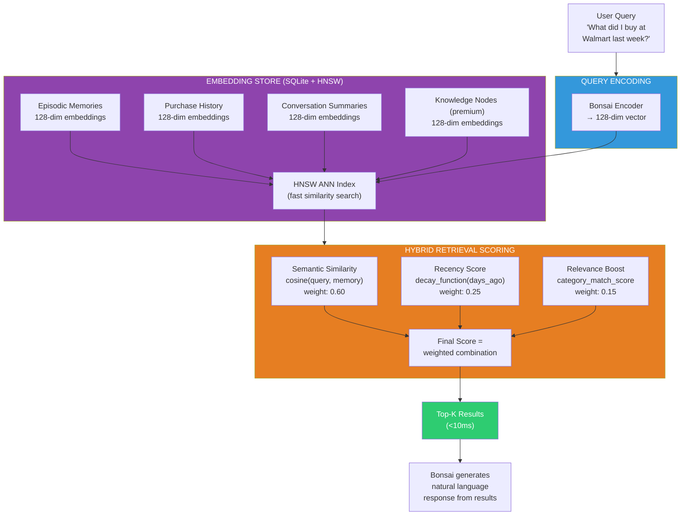
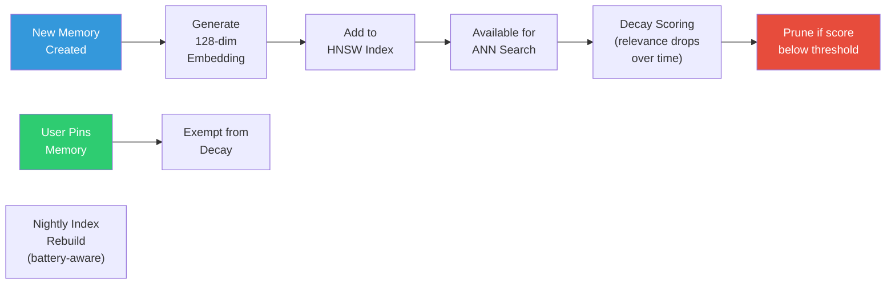

# Context Memory Retrieval (Local RAG with Semantic Search)

Adapted from Airbnb's BERT-based semantic search with ANN indexing.

```mermaid
graph TB
    QUERY["User Query<br/>'What did I buy at<br/>Walmart last week?'"]

    subgraph ENCODE["QUERY ENCODING"]
        BONSAI_ENC["Bonsai Encoder<br/>→ 128-dim vector"]
    end

    subgraph STORE["EMBEDDING STORE (SQLite + HNSW)"]
        direction TB
        EPISODIC["Episodic Memories<br/>128-dim embeddings"]
        PURCHASE["Purchase History<br/>128-dim embeddings"]
        CONVO["Conversation Summaries<br/>128-dim embeddings"]
        KNOWLEDGE["Knowledge Nodes (premium)<br/>128-dim embeddings"]
        HNSW["HNSW ANN Index<br/>(fast similarity search)"]

        EPISODIC --> HNSW
        PURCHASE --> HNSW
        CONVO --> HNSW
        KNOWLEDGE --> HNSW
    end

    subgraph HYBRID["HYBRID RETRIEVAL SCORING"]
        SEM["Semantic Similarity<br/>cosine(query, memory)<br/>weight: 0.60"]
        REC["Recency Score<br/>decay_function(days_ago)<br/>weight: 0.25"]
        REL["Relevance Boost<br/>category_match_score<br/>weight: 0.15"]
        FINAL["Final Score =<br/>weighted combination"]

        SEM --> FINAL
        REC --> FINAL
        REL --> FINAL
    end

    TOPK["Top-K Results<br/>(<10ms)"]

    RESPONSE["Bonsai generates<br/>natural language<br/>response from results"]

    QUERY --> ENCODE
    BONSAI_ENC --> HNSW
    HNSW --> HYBRID
    FINAL --> TOPK
    TOPK --> RESPONSE

    style ENCODE fill:#3498DB,color:#fff
    style STORE fill:#8E44AD,color:#fff
    style HYBRID fill:#E67E22,color:#fff
    style TOPK fill:#2ECC71,color:#fff
```

## Memory Lifecycle

```mermaid
graph LR
    CREATE["New Memory<br/>Created"] --> EMBED["Generate<br/>128-dim<br/>Embedding"]
    EMBED --> INDEX["Add to<br/>HNSW Index"]
    INDEX --> SERVE["Available for<br/>ANN Search"]
    SERVE --> DECAY["Decay Scoring<br/>(relevance drops<br/>over time)"]
    DECAY --> PRUNE["Prune if score<br/>below threshold"]

    PIN["User Pins<br/>Memory"] --> EXEMPT["Exempt from<br/>Decay"]

    REBUILD["Nightly Index<br/>Rebuild<br/>(battery-aware)"]

    style CREATE fill:#3498DB,color:#fff
    style PRUNE fill:#E74C3C,color:#fff
    style PIN fill:#2ECC71,color:#fff
```
