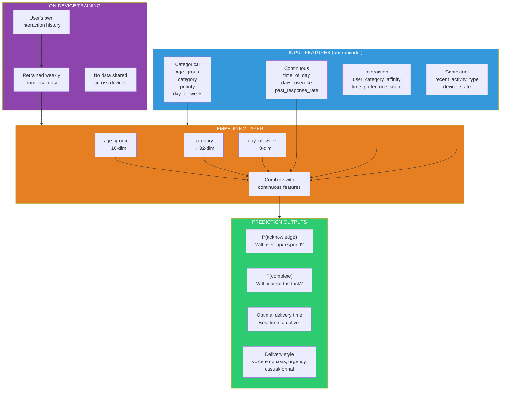

# Engagement Prediction Model (DLRM-style)

Adapted from Meta's Deep Learning Recommendation Model.

```mermaid
graph TB
    subgraph FEATURES["INPUT FEATURES (per reminder)"]
        direction LR
        CAT["Categorical<br/>age_group<br/>category<br/>priority<br/>day_of_week"]
        CONT["Continuous<br/>time_of_day<br/>days_overdue<br/>past_response_rate"]
        INTER["Interaction<br/>user_category_affinity<br/>time_preference_score"]
        CTX["Contextual<br/>recent_activity_type<br/>device_state"]
    end

    subgraph EMBEDDING["EMBEDDING LAYER"]
        AGE_EMB["age_group<br/>→ 16-dim"]
        CAT_EMB["category<br/>→ 32-dim"]
        DAY_EMB["day_of_week<br/>→ 8-dim"]
        COMBINE["Combine with<br/>continuous features"]

        AGE_EMB --> COMBINE
        CAT_EMB --> COMBINE
        DAY_EMB --> COMBINE
    end

    subgraph PREDICT["PREDICTION OUTPUTS"]
        P_ACK["P(acknowledge)<br/>Will user tap/respond?"]
        P_COMP["P(complete)<br/>Will user do the task?"]
        OPT_TIME["Optimal delivery time<br/>Best time to deliver"]
        STYLE["Delivery style<br/>voice emphasis, urgency,<br/>casual/formal"]
    end

    subgraph TRAINING["ON-DEVICE TRAINING"]
        HIST["User's own<br/>interaction history"]
        RETRAIN["Retrained weekly<br/>from local data"]
        PRIVACY["No data shared<br/>across devices"]
    end

    CAT --> EMBEDDING
    CONT --> COMBINE
    INTER --> COMBINE
    CTX --> COMBINE

    COMBINE --> PREDICT

    HIST --> RETRAIN
    RETRAIN --> EMBEDDING

    style FEATURES fill:#3498DB,color:#fff
    style EMBEDDING fill:#E67E22,color:#fff
    style PREDICT fill:#2ECC71,color:#fff
    style TRAINING fill:#8E44AD,color:#fff
```
