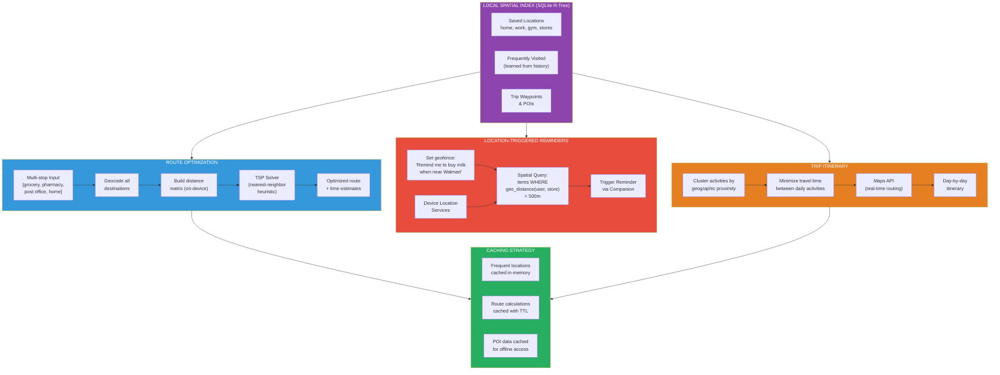

# Geospatial Engine & Trip Planner

Adapted from Airbnb's Elasticsearch-based geospatial service.

```mermaid
graph TB
    subgraph SPATIAL["LOCAL SPATIAL INDEX (SQLite R-Tree)"]
        SAVED["Saved Locations<br/>home, work, gym, stores"]
        FREQ["Frequently Visited<br/>(learned from history)"]
        TRIP_POI["Trip Waypoints<br/>& POIs"]
    end

    subgraph ROUTE["ROUTE OPTIMIZATION"]
        INPUT_R["Multi-stop Input<br/>[grocery, pharmacy,<br/>post office, home]"]
        GEO["Geocode all<br/>destinations"]
        DIST["Build distance<br/>matrix (on-device)"]
        TSP["TSP Solver<br/>(nearest-neighbor<br/>heuristic)"]
        RESULT["Optimized route<br/>+ time estimates"]

        INPUT_R --> GEO
        GEO --> DIST
        DIST --> TSP
        TSP --> RESULT
    end

    subgraph GEOFENCE["LOCATION-TRIGGERED REMINDERS"]
        FENCE_SET["Set geofence:<br/>'Remind me to buy milk<br/>when near Walmart'"]
        DEVICE_LOC["Device Location<br/>Services"]
        SPATIAL_Q["Spatial Query:<br/>items WHERE<br/>geo_distance(user, store)<br/>< 500m"]
        TRIGGER["Trigger Reminder<br/>via Companion"]

        FENCE_SET --> SPATIAL_Q
        DEVICE_LOC --> SPATIAL_Q
        SPATIAL_Q --> TRIGGER
    end

    subgraph TRIP["TRIP ITINERARY"]
        CLUSTER["Cluster activities by<br/>geographic proximity"]
        MINIMIZE["Minimize travel time<br/>between daily activities"]
        MAPS["Maps API<br/>(real-time routing)"]
        ITIN["Day-by-day<br/>itinerary"]

        CLUSTER --> MINIMIZE
        MINIMIZE --> MAPS
        MAPS --> ITIN
    end

    subgraph CACHE["CACHING STRATEGY"]
        LOC_CACHE["Frequent locations<br/>cached in-memory"]
        ROUTE_CACHE["Route calculations<br/>cached with TTL"]
        POI_CACHE["POI data cached<br/>for offline access"]
    end

    SPATIAL --> ROUTE
    SPATIAL --> GEOFENCE
    SPATIAL --> TRIP
    ROUTE --> CACHE
    TRIP --> CACHE

    style SPATIAL fill:#8E44AD,color:#fff
    style ROUTE fill:#3498DB,color:#fff
    style GEOFENCE fill:#E74C3C,color:#fff
    style TRIP fill:#E67E22,color:#fff
    style CACHE fill:#27AE60,color:#fff
```
