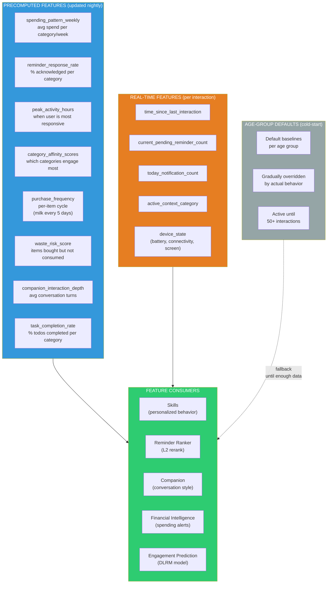

# User Behavior Feature Store

Adapted from Meta/Airbnb feature engineering and precomputation pipelines. Runs entirely on-device.

```mermaid
graph TB
    subgraph PRECOMPUTED["PRECOMPUTED FEATURES (updated nightly)"]
        F1["spending_pattern_weekly<br/>avg spend per category/week"]
        F2["reminder_response_rate<br/>% acknowledged per category"]
        F3["peak_activity_hours<br/>when user is most responsive"]
        F4["category_affinity_scores<br/>which categories engage most"]
        F5["purchase_frequency<br/>per-item cycle<br/>(milk every 5 days)"]
        F6["waste_risk_score<br/>items bought but not consumed"]
        F7["companion_interaction_depth<br/>avg conversation turns"]
        F8["task_completion_rate<br/>% todos completed per category"]
    end

    subgraph REALTIME["REAL-TIME FEATURES (per interaction)"]
        R1["time_since_last_interaction"]
        R2["current_pending_reminder_count"]
        R3["today_notification_count"]
        R4["active_context_category"]
        R5["device_state<br/>(battery, connectivity, screen)"]
    end

    subgraph COLDSTART["AGE-GROUP DEFAULTS (cold-start)"]
        CS1["Default baselines<br/>per age group"]
        CS2["Gradually overridden<br/>by actual behavior"]
        CS3["Active until<br/>50+ interactions"]
    end

    subgraph CONSUMERS["FEATURE CONSUMERS"]
        C1["Skills<br/>(personalized behavior)"]
        C2["Reminder Ranker<br/>(L2 rerank)"]
        C3["Companion<br/>(conversation style)"]
        C4["Financial Intelligence<br/>(spending alerts)"]
        C5["Engagement Prediction<br/>(DLRM model)"]
    end

    PRECOMPUTED --> CONSUMERS
    REALTIME --> CONSUMERS
    COLDSTART -.->|"fallback<br/>until enough data"| CONSUMERS

    style PRECOMPUTED fill:#3498DB,color:#fff
    style REALTIME fill:#E67E22,color:#fff
    style COLDSTART fill:#95A5A6,color:#fff
    style CONSUMERS fill:#2ECC71,color:#fff
```
