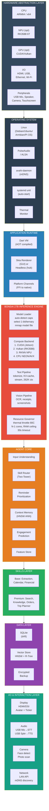

# Edge Device Full Architecture

```mermaid
graph TB
    subgraph HAL["HARDWARE ABSTRACTION LAYER"]
        direction LR
        CPU["CPU<br/>ARM64 / x64"]
        NPU["NPU (opt)<br/>RK3588 6T"]
        GPU["GPU (opt)<br/>CUDA/Vulkan"]
        IO["I/O<br/>HDMI, USB,<br/>Ethernet, Wi-Fi"]
        PERIPH["Peripherals<br/>USB Mic, Speaker,<br/>Camera, Touchscreen"]
    end

    subgraph OS["OPERATING SYSTEM"]
        direction LR
        LINUX["Linux<br/>(Debian/Ubuntu/<br/>Armbian/Pi OS)"]
        AUDIO["PulseAudio<br/>/ ALSA"]
        MDNS["avahi-daemon<br/>(mDNS)"]
        SYSTEMD["systemd unit<br/>(auto-start)"]
        THERMAL["Thermal<br/>Monitor"]
    end

    subgraph RUNTIME["APPLICATION RUNTIME"]
        direction LR
        DART["Dart VM<br/>(AOT compiled)"]
        SKIA["Skia Renderer<br/>(GUI) or<br/>Headless (hub)"]
        FFI["Platform Channels<br/>(FFI to native)"]
    end

    subgraph INFERENCE["BONSAI 27B INFERENCE ENGINE"]
        LOADER["Model Loader<br/>auto-detect caps<br/>select 1-bit/ternary<br/>mmap model file"]
        BACKEND["Compute Backend<br/>1. CUDA (Jetson)<br/>2. Vulkan (RK3588)<br/>3. RKNN NPU<br/>4. CPU NEON/AVX"]
        TEXT_P["Text Pipeline<br/>tokenize, KV-cache,<br/>stream, 262K ctx"]
        VISION_P["Vision Pipeline<br/>OCR, receipts,<br/>screenshots"]
        GOVERNOR["Resource Governor<br/>thermal throttle 80C<br/>N-1 cores, RAM ceiling<br/>30s timeout"]
    end

    subgraph AGENT_CORE["AGENT CORE"]
        direction LR
        IUP_E["Input Understanding"]
        ROUTER_E["Skill Router<br/>(Two-Tower)"]
        RANK_E["Reminder<br/>Prioritization"]
        MEM_E["Context Memory<br/>(HNSW ANN)"]
        DLRM_E["Engagement<br/>Prediction"]
        FEAT_E["Feature Store"]
    end

    subgraph SKILLS_E["SKILLS LAYER"]
        direction LR
        BASE_E["Base: Extraction,<br/>Calendar, Financial"]
        PREM_E["Premium: Search,<br/>Knowledge, Orders,<br/>Trip Planner"]
    end

    subgraph DATA_E["DATA LAYER"]
        direction LR
        SQLITE_E["SQLite<br/>(drift)"]
        VECTOR_E["Vector Store<br/>HNSW + R-Tree"]
        BACKUP_E["Encrypted<br/>Backup"]
    end

    subgraph IO_LAYER["I/O & INTERACTION LAYER"]
        direction LR
        DISPLAY["Display<br/>HDMI/DSI<br/>Avatar + Ticker"]
        AUDIO_IO["Audio<br/>USB Mic→STT<br/>USB Spkr→TTS"]
        CAM_IO["Camera<br/>Face detect<br/>Photo scan"]
        NET_IO["Network<br/>LAN API<br/>mDNS discovery"]
    end

    HAL --> OS
    OS --> RUNTIME
    RUNTIME --> INFERENCE
    INFERENCE --> AGENT_CORE
    AGENT_CORE --> SKILLS_E
    SKILLS_E --> DATA_E
    DATA_E --> IO_LAYER

    style HAL fill:#34495E,color:#fff
    style OS fill:#2C3E50,color:#fff
    style RUNTIME fill:#2980B9,color:#fff
    style INFERENCE fill:#E74C3C,color:#fff
    style AGENT_CORE fill:#E67E22,color:#fff
    style SKILLS_E fill:#27AE60,color:#fff
    style DATA_E fill:#8E44AD,color:#fff
    style IO_LAYER fill:#16A085,color:#fff
```
