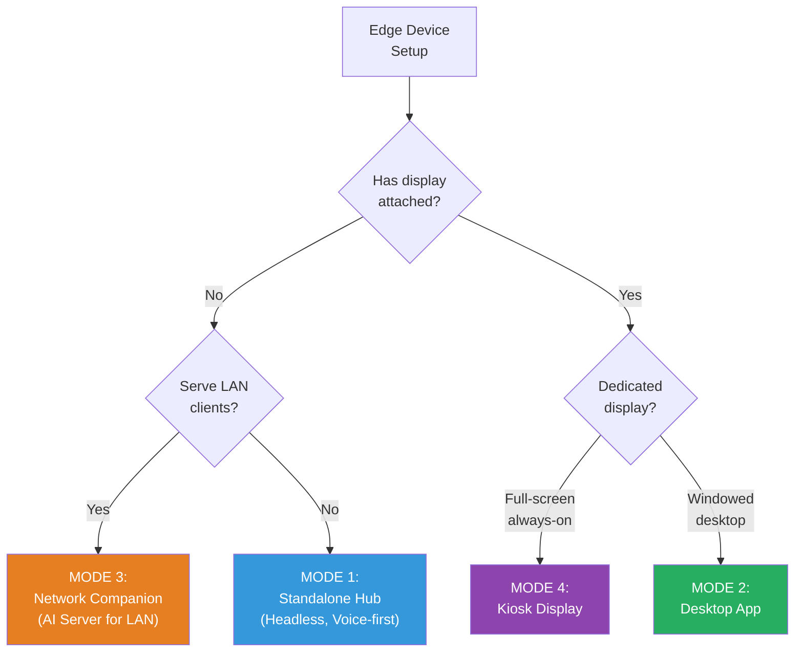
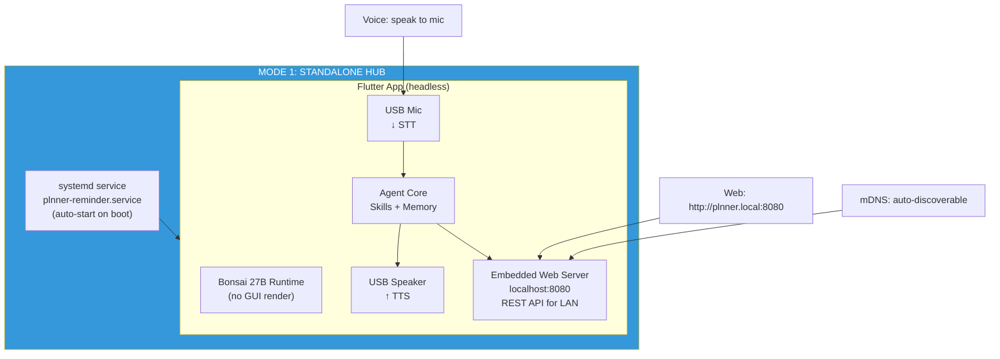
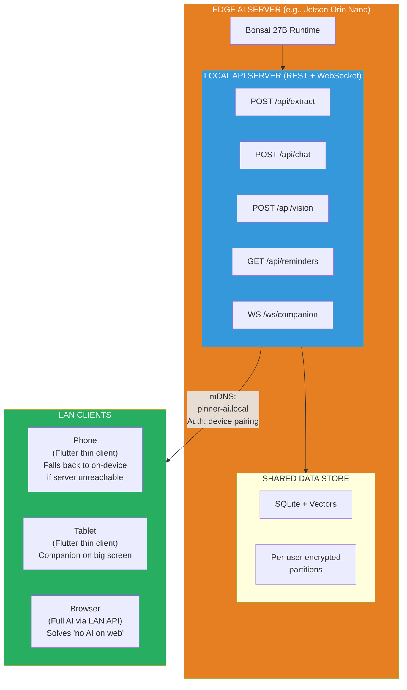
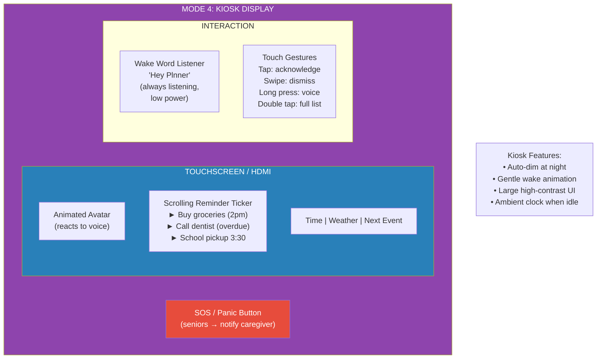

# Edge Deployment Modes

## Mode Selection

```mermaid
graph TB
    START["Edge Device<br/>Setup"] --> Q1{"Has display<br/>attached?"}

    Q1 -->|No| Q2{"Serve LAN<br/>clients?"}
    Q1 -->|Yes| Q3{"Dedicated<br/>display?"}

    Q2 -->|Yes| MODE3["MODE 3:<br/>Network Companion<br/>(AI Server for LAN)"]
    Q2 -->|No| MODE1["MODE 1:<br/>Standalone Hub<br/>(Headless, Voice-first)"]

    Q3 -->|"Full-screen<br/>always-on"| MODE4["MODE 4:<br/>Kiosk Display"]
    Q3 -->|"Windowed<br/>desktop"| MODE2["MODE 2:<br/>Desktop App"]

    style MODE1 fill:#3498DB,color:#fff
    style MODE2 fill:#27AE60,color:#fff
    style MODE3 fill:#E67E22,color:#fff
    style MODE4 fill:#8E44AD,color:#fff
```

## Mode 1: Standalone Hub (Headless)

```mermaid
graph TB
    subgraph HUB["MODE 1: STANDALONE HUB"]
        SYSTEMD["systemd service<br/>plnner-reminder.service<br/>(auto-start on boot)"]

        subgraph APP["Flutter App (headless)"]
            BONSAI_H["Bonsai 27B Runtime<br/>(no GUI render)"]

            MIC["USB Mic<br/>↓ STT"] --> CORE["Agent Core<br/>Skills + Memory"]
            CORE --> SPKR["USB Speaker<br/>↑ TTS"]
            CORE --> WEB_SRV["Embedded Web Server<br/>localhost:8080<br/>REST API for LAN"]
        end

        SYSTEMD --> APP
    end

    ACCESS1["Voice: speak to mic"] --> MIC
    ACCESS2["Web: http://plnner.local:8080"] --> WEB_SRV
    ACCESS3["mDNS: auto-discoverable"] --> WEB_SRV

    style HUB fill:#3498DB,color:#fff
```

## Mode 3: Network Companion (AI Server)

```mermaid
graph TB
    subgraph SERVER["EDGE AI SERVER (e.g., Jetson Orin Nano)"]
        BONSAI_S["Bonsai 27B Runtime"]

        subgraph API["LOCAL API SERVER (REST + WebSocket)"]
            EP1["POST /api/extract"]
            EP2["POST /api/chat"]
            EP3["POST /api/vision"]
            EP4["GET /api/reminders"]
            EP5["WS /ws/companion"]
        end

        subgraph SHARED["SHARED DATA STORE"]
            DB_S["SQLite + Vectors"]
            USERS["Per-user encrypted<br/>partitions"]
        end

        BONSAI_S --> API
        API --> SHARED
    end

    subgraph CLIENTS["LAN CLIENTS"]
        PHONE["Phone<br/>(Flutter thin client)<br/>Falls back to on-device<br/>if server unreachable"]
        TABLET["Tablet<br/>(Flutter thin client)<br/>Companion on big screen"]
        BROWSER["Browser<br/>(Full AI via LAN API)<br/>Solves 'no AI on web'"]
    end

    API -->|"mDNS:<br/>plnner-ai.local<br/>Auth: device pairing"| CLIENTS

    style SERVER fill:#E67E22,color:#fff
    style API fill:#3498DB,color:#fff
    style CLIENTS fill:#27AE60,color:#fff
```

## Mode 4: Kiosk Display

```mermaid
graph TB
    subgraph KIOSK["MODE 4: KIOSK DISPLAY"]
        subgraph SCREEN["TOUCHSCREEN / HDMI"]
            AVATAR["Animated Avatar<br/>(reacts to voice)"]
            TICKER["Scrolling Reminder Ticker<br/>► Buy groceries (2pm)<br/>► Call dentist (overdue)<br/>► School pickup 3:30"]
            INFO["Time | Weather | Next Event"]
        end

        subgraph INTERACT["INTERACTION"]
            WAKE["Wake Word Listener<br/>'Hey Plnner'<br/>(always listening,<br/>low power)"]
            TOUCH["Touch Gestures<br/>Tap: acknowledge<br/>Swipe: dismiss<br/>Long press: voice<br/>Double tap: full list"]
        end

        SOS["SOS / Panic Button<br/>(seniors → notify caregiver)"]
    end

    FEATURES_K["Kiosk Features:<br/>• Auto-dim at night<br/>• Gentle wake animation<br/>• Large high-contrast UI<br/>• Ambient clock when idle"]

    style KIOSK fill:#8E44AD,color:#fff
    style SCREEN fill:#2980B9,color:#fff
    style SOS fill:#E74C3C,color:#fff
```
