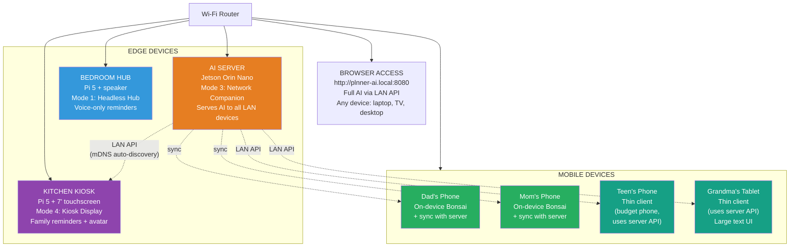
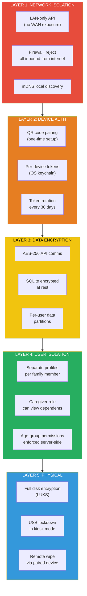

# Multi-Device Family Network Topology

```mermaid
graph TB
    ROUTER["Wi-Fi Router"]

    subgraph EDGE_DEVICES["EDGE DEVICES"]
        AI_SERVER["AI SERVER<br/>Jetson Orin Nano<br/>Mode 3: Network Companion<br/>Serves AI to all LAN devices"]
        KITCHEN["KITCHEN KIOSK<br/>Pi 5 + 7' touchscreen<br/>Mode 4: Kiosk Display<br/>Family reminders + avatar"]
        BEDROOM["BEDROOM HUB<br/>Pi 5 + speaker<br/>Mode 1: Headless Hub<br/>Voice-only reminders"]
    end

    subgraph MOBILE["MOBILE DEVICES"]
        DAD["Dad's Phone<br/>On-device Bonsai<br/>+ sync with server"]
        MOM["Mom's Phone<br/>On-device Bonsai<br/>+ sync with server"]
        TEEN["Teen's Phone<br/>Thin client<br/>(budget phone,<br/>uses server API)"]
        GRANDMA["Grandma's Tablet<br/>Thin client<br/>(uses server API)<br/>Large text UI"]
    end

    BROWSER_ACCESS["BROWSER ACCESS<br/>http://plnner-ai.local:8080<br/>Full AI via LAN API<br/>Any device: laptop, TV, desktop"]

    ROUTER --> AI_SERVER
    ROUTER --> KITCHEN
    ROUTER --> BEDROOM
    ROUTER --> MOBILE

    AI_SERVER -.->|"LAN API<br/>(mDNS auto-discovery)"| KITCHEN
    AI_SERVER -.->|"LAN API"| TEEN
    AI_SERVER -.->|"LAN API"| GRANDMA
    AI_SERVER -.->|"sync"| DAD
    AI_SERVER -.->|"sync"| MOM

    ROUTER --> BROWSER_ACCESS

    style AI_SERVER fill:#E67E22,color:#fff
    style KITCHEN fill:#8E44AD,color:#fff
    style BEDROOM fill:#3498DB,color:#fff
    style DAD fill:#27AE60,color:#fff
    style MOM fill:#27AE60,color:#fff
    style TEEN fill:#16A085,color:#fff
    style GRANDMA fill:#16A085,color:#fff
```

## Security Layers

```mermaid
graph TB
    subgraph L1["LAYER 1: NETWORK ISOLATION"]
        NET1["LAN-only API<br/>(no WAN exposure)"]
        NET2["Firewall: reject<br/>all inbound from internet"]
        NET3["mDNS local discovery"]
    end

    subgraph L2["LAYER 2: DEVICE AUTH"]
        AUTH1["QR code pairing<br/>(one-time setup)"]
        AUTH2["Per-device tokens<br/>(OS keychain)"]
        AUTH3["Token rotation<br/>every 30 days"]
    end

    subgraph L3["LAYER 3: DATA ENCRYPTION"]
        ENC1["AES-256 API comms"]
        ENC2["SQLite encrypted<br/>at rest"]
        ENC3["Per-user data<br/>partitions"]
    end

    subgraph L4["LAYER 4: USER ISOLATION"]
        USR1["Separate profiles<br/>per family member"]
        USR2["Caregiver role<br/>can view dependents"]
        USR3["Age-group permissions<br/>enforced server-side"]
    end

    subgraph L5["LAYER 5: PHYSICAL"]
        PHY1["Full disk encryption<br/>(LUKS)"]
        PHY2["USB lockdown<br/>in kiosk mode"]
        PHY3["Remote wipe<br/>via paired device"]
    end

    L1 --> L2 --> L3 --> L4 --> L5

    style L1 fill:#E74C3C,color:#fff
    style L2 fill:#E67E22,color:#fff
    style L3 fill:#F1C40F,color:#000
    style L4 fill:#27AE60,color:#fff
    style L5 fill:#3498DB,color:#fff
```
