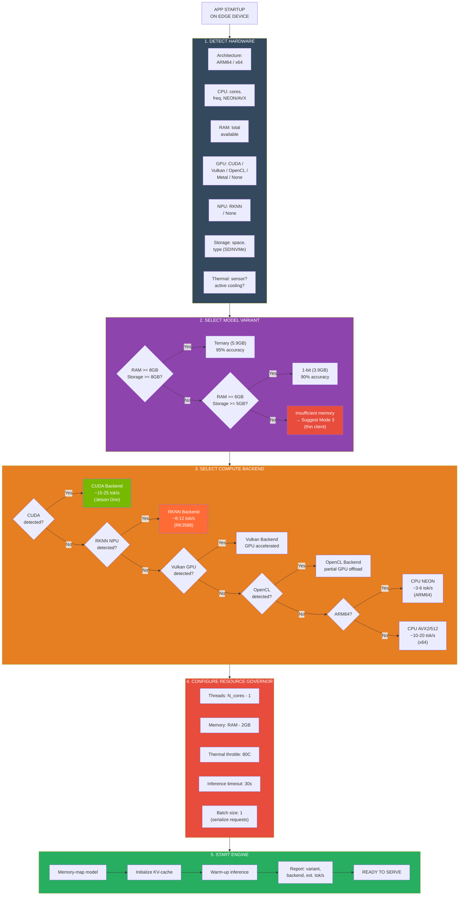

# Compute Backend Selection Flow

```mermaid
graph TB
    START["APP STARTUP<br/>ON EDGE DEVICE"]

    subgraph DETECT["1. DETECT HARDWARE"]
        ARCH["Architecture:<br/>ARM64 / x64"]
        CPUINFO["CPU: cores,<br/>freq, NEON/AVX"]
        RAMINFO["RAM: total<br/>available"]
        GPUINFO["GPU: CUDA /<br/>Vulkan / OpenCL /<br/>Metal / None"]
        NPUINFO["NPU: RKNN<br/>/ None"]
        STORAGE["Storage: space,<br/>type (SD/NVMe)"]
        THERM["Thermal: sensor?<br/>active cooling?"]
    end

    subgraph MODEL["2. SELECT MODEL VARIANT"]
        CHECK_RAM{"RAM >= 8GB<br/>Storage >= 8GB?"}
        CHECK_RAM6{"RAM >= 6GB<br/>Storage >= 5GB?"}
        TERNARY["Ternary (5.9GB)<br/>95% accuracy"]
        ONEBIT["1-bit (3.9GB)<br/>90% accuracy"]
        ERROR["Insufficient memory<br/>→ Suggest Mode 3<br/>(thin client)"]

        CHECK_RAM -->|Yes| TERNARY
        CHECK_RAM -->|No| CHECK_RAM6
        CHECK_RAM6 -->|Yes| ONEBIT
        CHECK_RAM6 -->|No| ERROR
    end

    subgraph BACKEND["3. SELECT COMPUTE BACKEND"]
        CUDA_Q{"CUDA<br/>detected?"}
        RKNN_Q{"RKNN NPU<br/>detected?"}
        VULKAN_Q{"Vulkan GPU<br/>detected?"}
        OPENCL_Q{"OpenCL<br/>detected?"}
        ARM_Q{"ARM64?"}

        CUDA_B["CUDA Backend<br/>~15-25 tok/s<br/>(Jetson Orin)"]
        RKNN_B["RKNN Backend<br/>~8-12 tok/s<br/>(RK3588)"]
        VULKAN_B["Vulkan Backend<br/>GPU accelerated"]
        OPENCL_B["OpenCL Backend<br/>partial GPU offload"]
        NEON_B["CPU NEON<br/>~3-6 tok/s<br/>(ARM64)"]
        AVX_B["CPU AVX2/512<br/>~10-20 tok/s<br/>(x64)"]

        CUDA_Q -->|Yes| CUDA_B
        CUDA_Q -->|No| RKNN_Q
        RKNN_Q -->|Yes| RKNN_B
        RKNN_Q -->|No| VULKAN_Q
        VULKAN_Q -->|Yes| VULKAN_B
        VULKAN_Q -->|No| OPENCL_Q
        OPENCL_Q -->|Yes| OPENCL_B
        OPENCL_Q -->|No| ARM_Q
        ARM_Q -->|Yes| NEON_B
        ARM_Q -->|No| AVX_B
    end

    subgraph GOVERNOR["4. CONFIGURE RESOURCE GOVERNOR"]
        THREADS["Threads: N_cores - 1"]
        MEM_CEIL["Memory: RAM - 2GB"]
        THERM_T["Thermal throttle: 80C"]
        TIMEOUT["Inference timeout: 30s"]
        BATCH["Batch size: 1<br/>(serialize requests)"]
    end

    subgraph LAUNCH["5. START ENGINE"]
        MMAP["Memory-map model"]
        KV["Initialize KV-cache"]
        WARM["Warm-up inference"]
        REPORT["Report: variant,<br/>backend, est. tok/s"]
        READY["READY TO SERVE"]

        MMAP --> KV --> WARM --> REPORT --> READY
    end

    START --> DETECT
    DETECT --> MODEL
    MODEL --> BACKEND
    BACKEND --> GOVERNOR
    GOVERNOR --> LAUNCH

    style DETECT fill:#34495E,color:#fff
    style MODEL fill:#8E44AD,color:#fff
    style BACKEND fill:#E67E22,color:#fff
    style GOVERNOR fill:#E74C3C,color:#fff
    style LAUNCH fill:#27AE60,color:#fff
    style CUDA_B fill:#76B900,color:#fff
    style RKNN_B fill:#FF6B35,color:#fff
    style ERROR fill:#E74C3C,color:#fff
```
