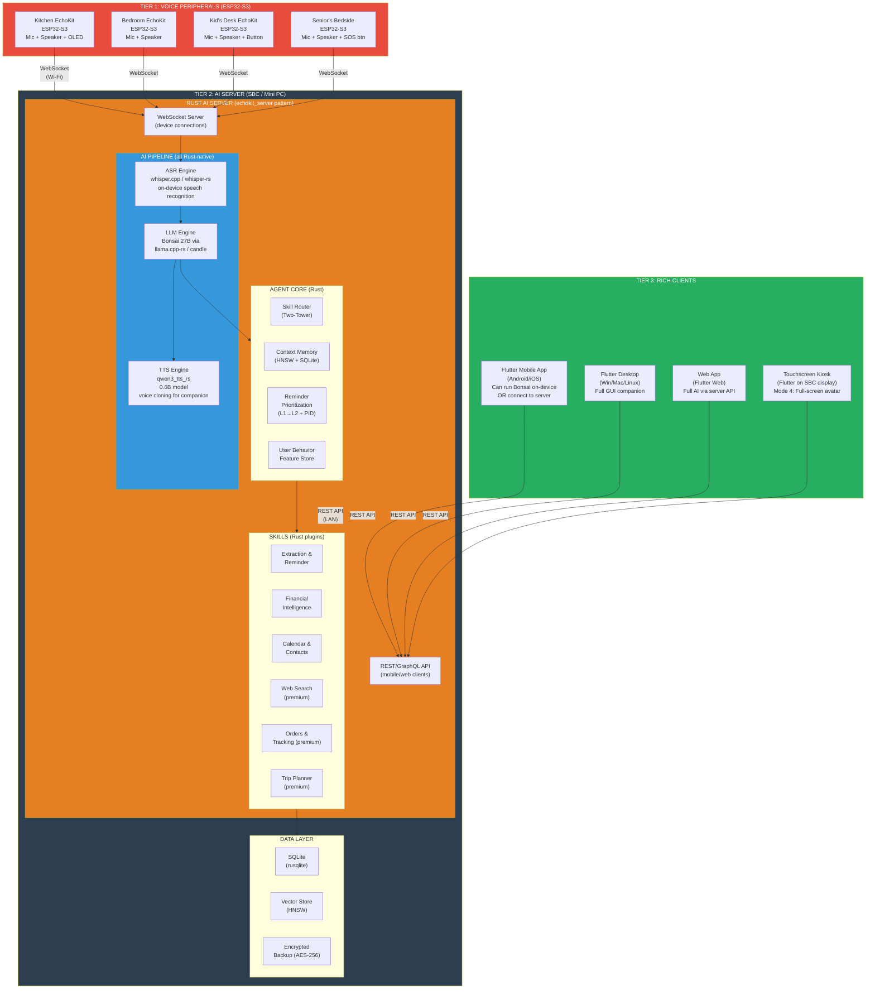
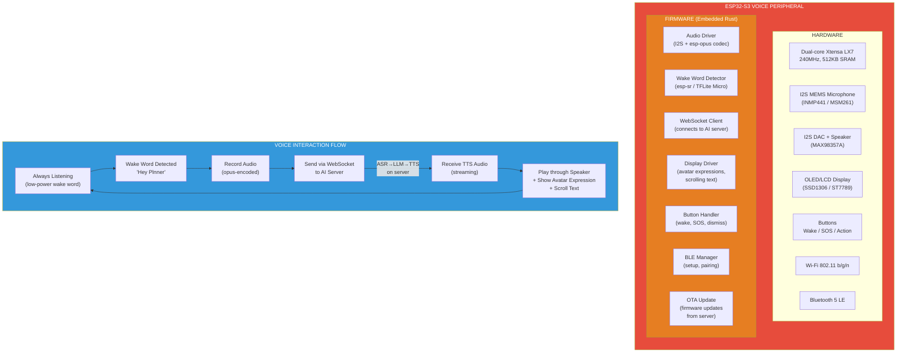
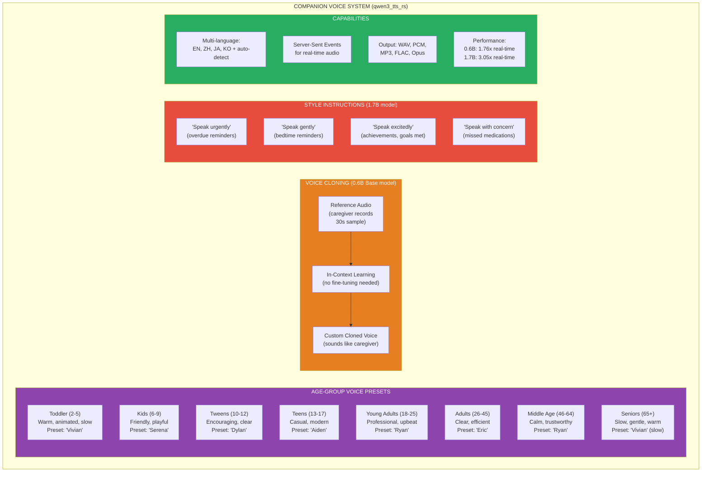
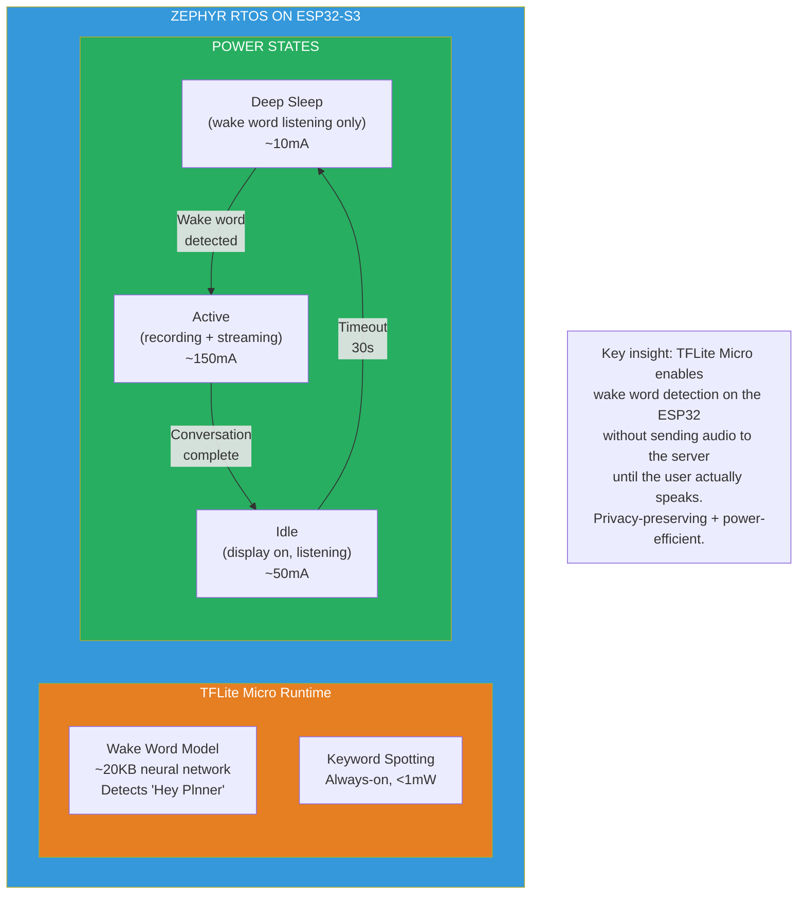
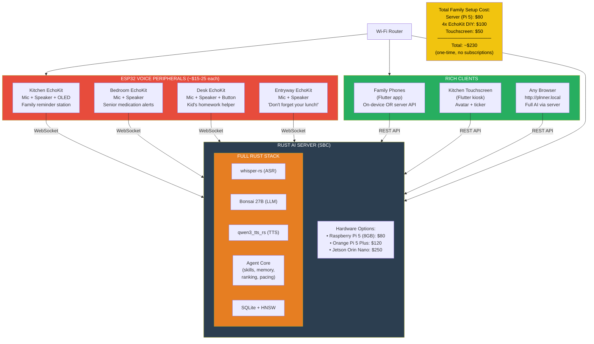
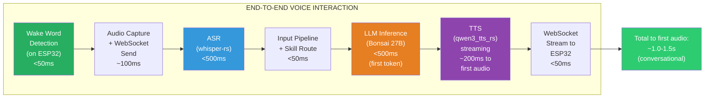

# EchoKit-Inspired Rust Edge Architecture

## Overview

Inspired by EchoKit (second-state), qwen3_tts_rs, and the Rust AI infrastructure thesis.
The edge deployment evolves from a monolithic Flutter app into a **client-server split**:
lightweight voice peripherals (ESP32) + powerful Rust AI server on SBC.

## Three-Tier Edge Architecture

## Voice Peripheral Detail (ESP32-S3)

## Rust AI Server Pipeline Detail

```mermaid
graph LR
    subgraph ASR_STAGE["ASR STAGE (<500ms)"]
        AUDIO_IN["Opus Audio<br/>(from ESP32)"]
        DECODE["Opus Decode"]
        WHISPER["whisper-rs<br/>(whisper.cpp Rust bindings)<br/>small.en model<br/>~300ms for 5s audio"]
        TEXT_OUT["Transcribed Text"]

        AUDIO_IN --> DECODE --> WHISPER --> TEXT_OUT
    end

    subgraph LLM_STAGE["LLM STAGE (<500ms)"]
        INPUT_PIPE["Input Understanding<br/>Pipeline"]
        SKILL_ROUTE["Skill Router<br/>(Two-Tower)"]
        BONSAI_INF["Bonsai 27B<br/>Inference<br/>(llama.cpp-rs)"]
        CONTEXT["Context Memory<br/>Retrieval (HNSW)"]
        RESPONSE["Generated<br/>Response Text"]

        TEXT_OUT --> INPUT_PIPE
        INPUT_PIPE --> SKILL_ROUTE
        SKILL_ROUTE --> BONSAI_INF
        CONTEXT --> BONSAI_INF
        BONSAI_INF --> RESPONSE
    end

    subgraph TTS_STAGE["TTS STAGE (<500ms)"]
        PERSONA["Companion Persona<br/>Selection<br/>(age-group voice)"]
        QWEN_TTS["qwen3_tts_rs<br/>0.6B CustomVoice<br/>1.76x real-time"]
        STREAM["Streaming Audio<br/>(PCM/Opus)"]
        WS_OUT["WebSocket Stream<br/>to ESP32"]

        RESPONSE --> PERSONA
        PERSONA --> QWEN_TTS
        QWEN_TTS --> STREAM
        STREAM --> WS_OUT
    end

    style ASR_STAGE fill:#3498DB,color:#fff
    style LLM_STAGE fill:#E67E22,color:#fff
    style TTS_STAGE fill:#27AE60,color:#fff
```

## Companion Voice with Qwen3 TTS

## Zephyr RTOS: Ultra-Low-Power Wake Word Detection

## Full Family Deployment with EchoKit Peripherals

## Architecture Decision: Rust vs Flutter for Edge

```mermaid
graph TB
    subgraph DECISION["ARCHITECTURE SPLIT"]
        subgraph RUST_DOMAIN["RUST DOMAIN (Server + Firmware)"]
            R1["AI Inference<br/>(Bonsai 27B via llama.cpp-rs)"]
            R2["ASR (whisper-rs)"]
            R3["TTS (qwen3_tts_rs)"]
            R4["Agent Core<br/>(skills, memory, ranking)"]
            R5["WebSocket Server<br/>(device connections)"]
            R6["REST API Server<br/>(client connections)"]
            R7["ESP32 Firmware<br/>(embedded Rust)"]
            R8["Data Layer<br/>(rusqlite + HNSW)"]
        end

        subgraph FLUTTER_DOMAIN["FLUTTER DOMAIN (UI Clients)"]
            F1["Mobile App<br/>(Android + iOS)"]
            F2["Desktop App<br/>(Win + Mac + Linux)"]
            F3["Web App<br/>(Browser)"]
            F4["Kiosk Display<br/>(Touchscreen on SBC)"]
            F5["Companion Avatar<br/>(Skia rendering)"]
            F6["Age-Adaptive UI<br/>(8 themes)"]
        end
    end

    subgraph WHY["WHY THIS SPLIT"]
        W1["Rust: 7-10x faster inference<br/>Memory safety without GC<br/>Zero-cost abstractions<br/>Native ARM64 + x64<br/>WASM compilation<br/>Real-time audio processing"]
        W2["Flutter: Best cross-platform UI<br/>Rich animation (Skia)<br/>Hot reload development<br/>Single codebase for 6 platforms<br/>Widget ecosystem<br/>Accessibility built-in"]
    end

    RUST_DOMAIN --> |"REST + WebSocket<br/>API boundary"| FLUTTER_DOMAIN

    style RUST_DOMAIN fill:#E67E22,color:#fff
    style FLUTTER_DOMAIN fill:#3498DB,color:#fff
    style WHY fill:#27AE60,color:#fff
```

## Latency Budget (EchoKit-style Pipeline)

